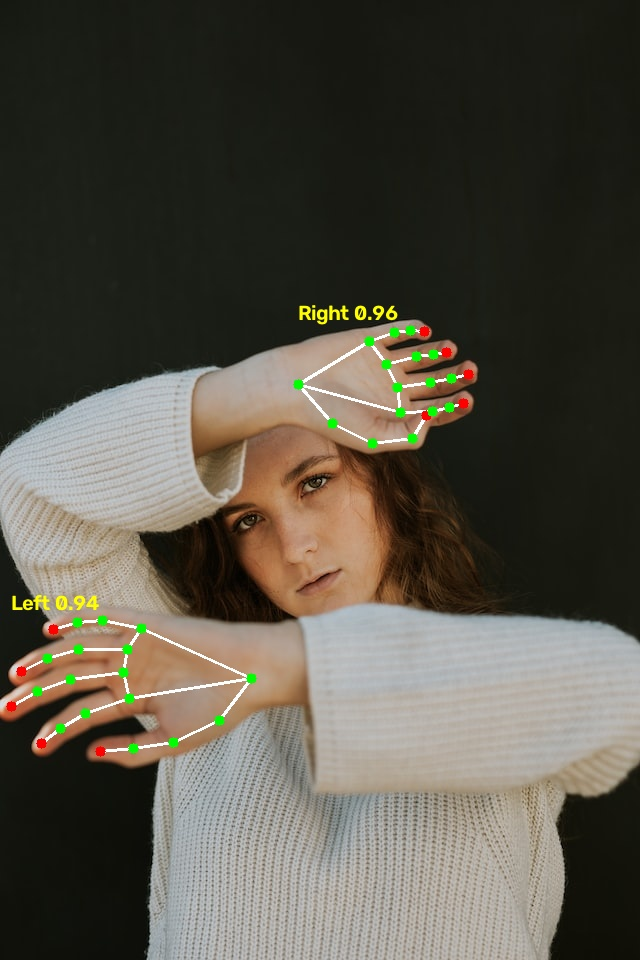
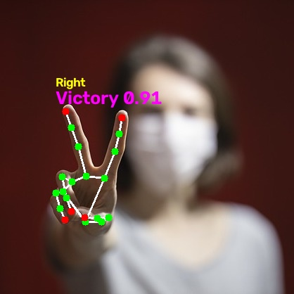
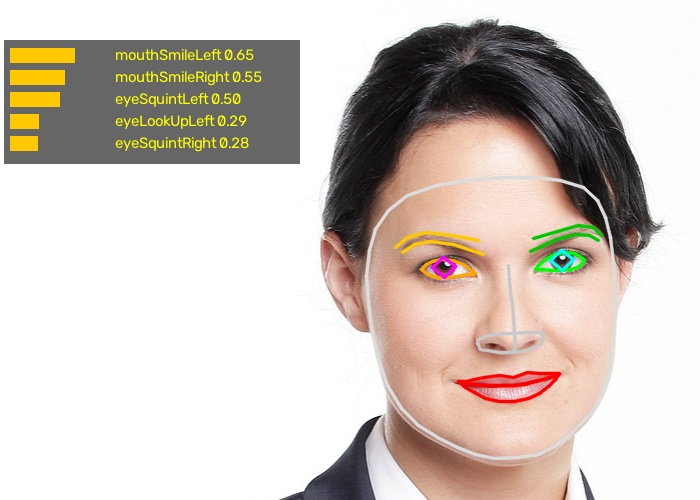
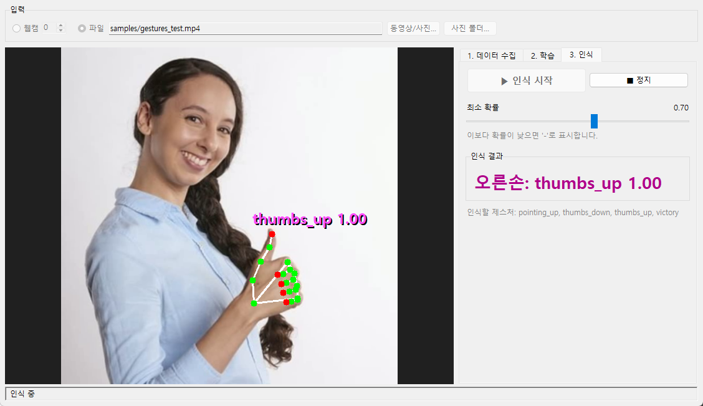

# MediaPipe Vision (Python)

[MediaPipe Tasks](https://developers.google.com/edge/mediapipe/solutions/guide) API로 만든 손 랜드마크, 손 제스처 인식, 얼굴 랜드마크 예제입니다.
웹캠, 동영상, 이미지 파일을 입력으로 쓸 수 있습니다.

| 스크립트 | 기능 | 모델 |
|---|---|---|
| `hand_webcam.py` | 손 랜드마크 21점, 왼손/오른손 구분 | `models/hand_landmarker.task` |
| `gesture_webcam.py` | 손 제스처 인식 (7종) + 손 랜드마크 | `models/gesture_recognizer.task` |
| `face_webcam.py` | 얼굴 랜드마크 478점 + 표정 점수(blendshape) 52종 | `models/face_landmarker.task` |
| `custom_gesture/app.py` | 내가 정한 제스처를 수집·학습·인식하는 GUI ([아래 설명](#나만의-제스처-학습)) | `models/gesture_recognizer.task` + 직접 학습한 분류기 |
| `web/serve.py` | 학습한 제스처에 맞춰 로고/이모지를 띄우는 웹 페이지 ([아래 설명](#웹-버전-제스처-이펙트)) | 위와 같음 (브라우저에서 실행) |

## 설치

```bash
pip install -r requirements.txt
```

테스트 환경: Windows 11, Python 3.14, mediapipe 1.1.0 (OpenCV는 mediapipe와 함께 설치됨)

## 실행

세 스크립트 모두 사용법이 같습니다.

```bash
python gesture_webcam.py                                  # 웹캠 (기본 0번)
python gesture_webcam.py --source 1                       # 다른 웹캠 번호
python gesture_webcam.py --source samples/gestures_test.mp4   # 동영상
python gesture_webcam.py --source samples/victory.jpg     # 이미지
```

- 종료: `q` 또는 `ESC` (이미지는 아무 키)
- 웹캠 입력은 거울 모드(좌우 반전)로 표시됩니다.
- `face_webcam.py`는 `--mesh` 옵션으로 얼굴 전체 메쉬를 표시할 수 있고, 실행 중에는 `m` 키로 켜고 끕니다.

## 결과 예시

| 손 랜드마크 | 제스처 인식 | 얼굴 랜드마크 |
|---|---|---|
|  |  |  |

## 인식하는 제스처

`Closed_Fist`(주먹), `Open_Palm`(손바닥), `Pointing_Up`(검지 위로), `Thumb_Up`, `Thumb_Down`, `Victory`(브이), `ILoveYou`(🤟)

해당 없거나 점수가 `MIN_GESTURE_SCORE`(기본 0.5)보다 낮으면 `-`로 표시합니다.

## 나만의 제스처 학습

기본 7종 외의 제스처를 직접 정해서 학습시킬 수 있습니다. 수집, 학습, 인식을 한 창에서 하는 프로그램입니다.

```bash
python custom_gesture/app.py
```



Gesture Recognizer로 얻은 손 랜드마크 21점을 특징으로 바꾸고, 이 특징으로 작은 신경망(scikit-learn MLP)을 학습합니다. (Gesture Recognizer의 랜드마크는 Hand Landmarker와 똑같고, 기본 제스처 7종도 함께 알려 줍니다.)
손 사진이 아니라 좌표만 저장하므로 데이터가 작고 학습은 몇 초면 끝납니다.

### 사용 순서

1. **입력 고르기 (위쪽):** `웹캠`(번호 선택), 또는 `파일`에서 `동영상/사진...`이나 `사진 폴더...`를 고릅니다. 웹캠이 없으면 휴대폰으로 찍은 영상을 쓰면 됩니다.
2. **1. 데이터 수집 탭**
   - `제스처 이름`에 이름을 적습니다 (예: `heart`). 한글 이름도 됩니다.
   - 웹캠: `▶ 미리보기`로 손 위치를 확인하고 `● 녹화 시작`을 누르면 3초 뒤부터 저장합니다. `최대 개수`(기본 300)가 차거나 `■ 녹화 정지`를 누르면 멈춥니다.
   - 동영상/사진: `● 녹화 시작`을 누르면 손이 보이는 프레임을 모두 저장합니다.
   - 제스처마다 반복합니다. 모은 개수는 아래 `모은 데이터` 목록에 나오고, 잘못 모은 제스처는 골라서 삭제할 수 있습니다.
3. **2. 학습 탭:** `학습 시작`을 누릅니다. 20%를 떼어 검증한 정확도와 혼동 행렬을 보여 준 뒤, 전체 데이터로 다시 학습해서 저장합니다.
4. **3. 인식 탭:** `▶ 인식 시작`을 누르면 화면과 오른쪽 `인식 결과`에 제스처와 확률이 나옵니다. 확률이 `최소 확률`보다 낮으면 `-`로 표시합니다.

**잘 학습시키는 팁**

- 제스처당 **200~500개**를 권장합니다. 손 각도, 거리, 위치, 조명을 바꿔 가며 모아야 실제 인식이 잘 됩니다.
- 아무 제스처도 아닌 손 모양을 `none`으로 모아 두면, 평범한 손을 다른 제스처로 잘못 인식하는 일이 줄어듭니다.
- **기본 제스처 거르기:** 새 제스처를 찍다 보면 손 모양을 바꾸는 사이에 엄지척 같은 다른 동작이 섞입니다. 그래서 `none`이 아닌 제스처를 모을 때는 기본 인식기가 알아보는 제스처(엄지척, 검지 위로, 브이 등)로 보이는 프레임을 저장하지 않고, 인식할 때도 기본 제스처로 보이는 손은 새 제스처로 판단하지 않습니다 (화면에 `(Thumb_Up)`처럼 표시). 새 제스처가 기본 제스처와 같은 모양이라면 `common.py`의 `SKIP_BUILTIN`과 `web/app.js`의 `SKIP_BUILTIN`을 `false`로 바꾸세요.
- **엄지 접기 합성:** nike처럼 엄지를 펴는 제스처가 엄지만 다른 손 모양(검지 위로 등)과 헷갈리면, 학습 탭에서 `엄지만 접은 손을 none으로 합성할 제스처`로 그 제스처를 고르세요 (명령줄은 `train.py --fold-thumb nike`). 그 제스처 샘플마다 엄지만 접은 손을 만들어 none으로 학습합니다.
- 왼손은 좌우를 뒤집어 오른손 모양으로 맞춰 저장합니다. 그래서 한 손으로만 모아도 양손 모두 인식됩니다 (`common.py`의 `MIRROR_LEFT_HAND`).

데이터는 `custom_gesture/data/gestures.csv`, 학습한 분류기는 `custom_gesture/gesture_classifier.joblib`에 저장됩니다.

### 명령줄로 쓰기

같은 기능을 명령줄로도 쓸 수 있습니다. 동영상 여러 개를 한꺼번에 처리할 때 편합니다.

```bash
python custom_gesture/collect.py --label heart --source heart.mp4   # 수집 (웹캠은 SPACE로 녹화)
python custom_gesture/train.py --fold-thumb nike                    # 학습 (엄지 접기 합성은 선택)
python custom_gesture/recognize.py --source test.mp4                # 인식
```

명령줄 인식 화면은 OpenCV로 글자를 그리므로 한글 제스처 이름이 `???`로 보입니다. 한글 이름은 `app.py`에서 쓰세요.

> MediaPipe 공식 방법인 [Model Maker](https://ai.google.dev/edge/mediapipe/solutions/customization/gesture_recognizer)는 TensorFlow 기반인데, 이 환경(Windows, Python 3.14)에서는 오래된 의존성(`tf-models-official==2.11.6`) 때문에 설치가 실패합니다. 그래서 같은 원리(랜드마크 → 분류기)를 scikit-learn으로 구현했습니다.

## 웹 버전: 제스처 이펙트

학습한 분류기로 브라우저에서 제스처를 인식해 효과를 띄웁니다. `nike`를 인식하면 나이키 로고, `ok`를 인식하면 👌 이모지가 손 위에 나타납니다.

```bash
python web/serve.py        # http://localhost:8000/web/ 이 자동으로 열림, 종료는 Ctrl+C
```

**온라인 데모 (GitHub Pages):** https://geonyole-ae.github.io/mediapipe-vision-python/
올라가 있는 분류기는 휴대폰 영상 4개(nike 1, ok 1, none 2)로 학습했습니다 (기본 제스처 거르기 + nike 엄지 접기 합성). 영상마다 뒤 20%를 학습에서 빼고 확인한 프레임 단위 정확도는 약 96%이고, 예제 영상의 엄지척·브이·검지 위로·엄지 아래는 모두 기본 제스처로 처리됩니다. 같은 방·조명에서만 찍었으므로 다른 환경에서는 정확도가 낮을 수 있습니다.
`🎬 예제 영상`에는 nike·ok 동작이 없으므로 효과가 뜨지 않는 것이 정상입니다.

GitHub Pages에 올린 분류기를 바꾸려면, 학습한 뒤 JSON으로 내보내서 커밋·푸시합니다.

```bash
python custom_gesture/train.py --fold-thumb nike   # 또는 app.py 학습 탭
python web/serve.py --export      # custom_gesture/gesture_classifier.joblib -> web/model/gesture_classifier.json
git add web/model/gesture_classifier.json && git commit -m "분류기 업데이트" && git push
```

1. `custom_gesture/app.py`에서 `nike`, `ok`라는 이름으로 데이터를 모으고 학습합니다. 아무 제스처도 아닌 손을 `none`으로 같이 모으는 것을 권장합니다.
2. `python web/serve.py`를 실행하면 페이지가 열립니다.
3. `📷 웹캠`, `📁 동영상/사진 열기`, `🎬 예제 영상` 중 하나를 고릅니다.

- 손 인식은 브라우저 안에서 MediaPipe JS(`@mediapipe/tasks-vision` 1.1.0)로 하고, 분류기는 `serve.py`가 joblib 파일을 JSON으로 바꿔서 넘겨 줍니다. 다시 학습한 뒤에는 페이지만 새로고침하면 됩니다.
- 효과를 바꾸거나 추가하려면 `web/app.js` 위쪽의 `EFFECTS`를 고칩니다. 예: `heart: { emoji: "❤️", name: "하트" }`. 이미지는 `{ image: "assets/파일.png" }`처럼 씁니다.
- `web/assets/nike.svg`는 스우시 모양을 단순하게 그린 것입니다. 공식 로고 이미지를 쓰려면 같은 이름으로 덮어쓰거나 `EFFECTS`의 경로를 바꾸세요. 나이키 로고는 Nike의 상표이므로 저장소를 공개할 때는 주의하세요.
- 동영상은 브라우저가 재생할 수 있는 형식(H.264 mp4, WebM)이어야 합니다. 휴대폰 영상은 대부분 그대로 됩니다. OpenCV로 만든 `gestures_test.mp4`는 브라우저에서 재생되지 않아서 `gestures_test.webm`을 따로 두었습니다.
- 웹캠은 `localhost`나 `https` 주소에서만 켜집니다 (브라우저 보안 정책). 파일을 더블클릭해서 열면 동작하지 않으니 로컬에서는 꼭 `serve.py`로 실행하세요.
- `serve.py`는 `custom_gesture/gesture_classifier.joblib`이 있으면 그것을, 없으면 `web/model/gesture_classifier.json`을 씁니다.

## 참고 사항

- **왼손/오른손:** 모델은 좌우 반전하지 않은 이미지를 기준으로 왼손/오른손을 판단합니다. 그래서 거울 모드로 표시하는 웹캠 입력에서만 라벨을 뒤집어 실제 손과 맞춥니다.
- **실행 모드:** 모든 입력을 `VIDEO` 실행 모드로 처리하므로 프레임마다 증가하는 타임스탬프를 넣습니다.
- **웹캠이 없을 때:** `samples/gestures_test.mp4`는 제스처 사진 4장으로 만든 테스트 영상입니다 (`tools/make_test_video.py`로 다시 만들 수 있음).

## 폴더 구조

```
├── hand_webcam.py
├── gesture_webcam.py
├── face_webcam.py
├── models/            # MediaPipe 모델 번들 (.task)
├── samples/           # 예제 이미지·영상과 결과 이미지
├── custom_gesture/    # 나만의 제스처 학습
│   ├── app.py         #   수집·학습·인식 GUI
│   ├── collect.py     #   데이터 수집 → data/gestures.csv
│   ├── train.py       #   분류기 학습 → gesture_classifier.joblib
│   ├── recognize.py   #   학습한 제스처 인식
│   └── common.py      #   공통 코드 (특징 추출 등)
├── web/               # 웹 버전 (제스처 이펙트)
│   ├── serve.py       #   로컬 서버 + 분류기 JSON 변환
│   ├── index.html, app.js, style.css
│   └── assets/nike.svg
└── tools/
    └── make_test_video.py
```

## 모델 출처

모델은 Google MediaPipe 공식 문서에서 받았습니다 (Apache License 2.0).

- [Hand Landmarker](https://developers.google.com/edge/mediapipe/solutions/vision/hand_landmarker): `https://storage.googleapis.com/mediapipe-models/hand_landmarker/hand_landmarker/float16/latest/hand_landmarker.task`
- [Gesture Recognizer](https://developers.google.com/edge/mediapipe/solutions/vision/gesture_recognizer): `https://storage.googleapis.com/mediapipe-models/gesture_recognizer/gesture_recognizer/float16/latest/gesture_recognizer.task`
- [Face Landmarker](https://developers.google.com/edge/mediapipe/solutions/vision/face_landmarker): `https://storage.googleapis.com/mediapipe-models/face_landmarker/face_landmarker/float16/latest/face_landmarker.task`

예제 이미지는 MediaPipe 공식 예제에서 쓰는 이미지입니다 (`storage.googleapis.com/mediapipe-tasks`, `mediapipe-assets`).
